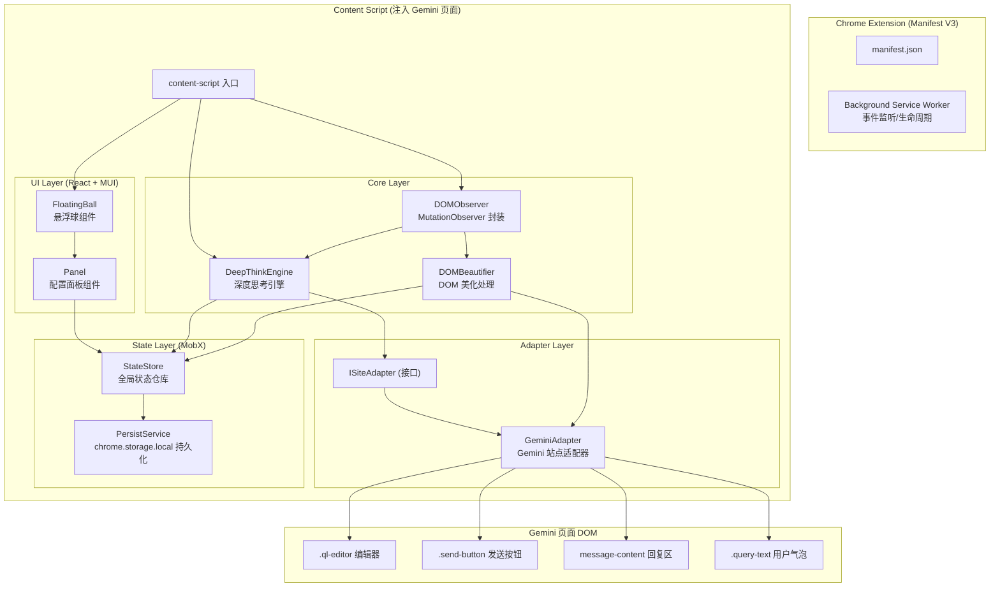
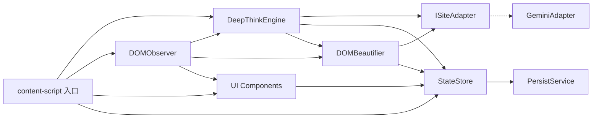
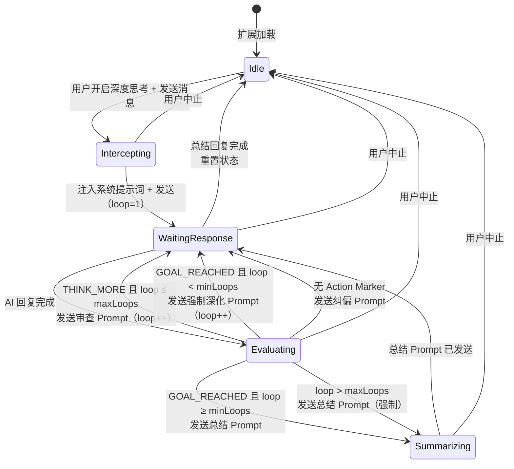

# 技术设计文档：Gemini Deep Think Extension

## 概述

本设计文档描述将现有 Gemini 深度思考 UserScript（main.js）迁移为 Chrome/Edge Manifest V3 浏览器扩展的技术方案。扩展通过 Content Script 注入 Gemini 页面，以 React 悬浮球 + Panel 提供可视化配置与状态展示，核心深度思考引擎用 TypeScript class 重构，DOM 操作通过 Site Adapter 接口封装以预留多站点扩展能力。

### 设计目标

- 完整迁移 main.js 的全部功能，行为与原 UserScript 一致
- 采用 Manifest V3 + Vite（Rolldown）+ React 18 + TypeScript + MUI + MobX 现代技术栈
- 通过 Site Adapter 接口模式解耦 DOM 操作，预留多站点扩展
- 模块结构预留 Skills 功能扩展入口
- 配置持久化到 chrome.storage.local，支持跨会话恢复

## 架构

### 系统架构图



### 构建产物结构

```
dist/
├── manifest.json
├── content-script.js      # Vite 打包的 Content Script（含 React、MUI、MobX）
├── content-script.css      # 提取的 CSS（含 MUI 样式）
├── background.js           # Service Worker（最小化，仅处理扩展生命周期）
└── icons/                  # 扩展图标
```

Vite 配置要点：
- 使用 `vite build` 的 library mode 或 IIFE 格式输出 content-script
- CSS 通过 manifest.json 的 `css` 字段注入，或在 content-script 中动态注入
- MUI 的 CSS-in-JS（Emotion）需要在 Shadow DOM 或页面 `<head>` 中正确挂载
- React 组件挂载到 Content Script 创建的容器 DOM 节点上

### 模块依赖关系



## 组件与接口

### 1. ISiteAdapter 接口

Site Adapter 是核心抽象层，封装所有与特定 AI 站点 DOM 的交互。Deep Think Engine 和 DOM Beautifier 仅通过此接口操作页面。

```typescript
interface ISiteAdapter {
  /** 获取文本编辑器 DOM 元素 */
  getEditor(): HTMLElement | null;

  /** 获取发送按钮 DOM 元素 */
  getSendButton(): HTMLElement | null;

  /** 判断 AI 是否正在生成回复 */
  isGenerating(): boolean;

  /** 获取最后一条 AI 回复的原始文本 */
  getLastResponseText(): string;

  /** 向编辑器插入文本并触发发送 */
  insertTextAndSend(text: string): Promise<void>;

  /** 获取所有用户消息气泡元素 */
  getUserBubbles(): NodeListOf<Element>;

  /** 获取所有 AI 回复消息元素 */
  getResponseMessages(): NodeListOf<Element>;

  /** 获取 MutationObserver 需要监听的目标节点和配置 */
  getObserverConfig(): { target: Node; options: MutationObserverInit };

  /** 判断 mutation 是否表示回复生成完成 */
  isGenerationComplete(mutation: MutationRecord): boolean;

  /** 判断 mutation 是否表示回复生成开始 */
  isGenerationStarted(mutation: MutationRecord): boolean;

  /** 判断是否需要重新注入 UI（SPA 导航场景） */
  shouldReinjectUI(mutations: MutationRecord[]): boolean;
}
```

### 2. GeminiAdapter 实现

```typescript
class GeminiAdapter implements ISiteAdapter {
  private selectors = {
    editor: '.ql-editor',
    sendButton: '.send-button',
    sendButtonStop: '.send-button.stop',
    messageContent: 'message-content',
    queryText: '.query-text',
    queryTextLine: '.query-text-line',
    userBubble: '.user-query-bubble-with-background',
    leadingActions: '.leading-actions-wrapper',
    toolboxDrawer: 'toolbox-drawer',
    expandButton: '.expand-button',
  };

  getEditor(): HTMLElement | null {
    return document.querySelector(this.selectors.editor);
  }

  getSendButton(): HTMLElement | null {
    return document.querySelector(this.selectors.sendButton);
  }

  isGenerating(): boolean {
    const btn = this.getSendButton();
    return btn?.classList.contains('stop') ?? false;
  }

  getLastResponseText(): string {
    const msgs = document.querySelectorAll(this.selectors.messageContent);
    return msgs.length > 0 ? msgs[msgs.length - 1].innerText : '';
  }

  async insertTextAndSend(text: string): Promise<void> {
    const editor = this.getEditor();
    if (!editor) return;

    editor.focus();
    document.execCommand('selectAll', false, undefined);
    document.execCommand('insertText', false, text);
    editor.dispatchEvent(new Event('input', { bubbles: true, cancelable: true }));

    // 轮询等待发送按钮可用
    return new Promise((resolve) => {
      let checks = 0;
      const interval = setInterval(() => {
        const btn = this.getSendButton();
        checks++;
        if (btn && !btn.disabled && !btn.classList.contains('stop')) {
          clearInterval(interval);
          setTimeout(() => { btn.click(); resolve(); }, 150);
        } else if (checks > 15) {
          clearInterval(interval);
          resolve();
        }
      }, 200);
    });
  }

  getUserBubbles(): NodeListOf<Element> {
    return document.querySelectorAll(this.selectors.queryText);
  }

  getResponseMessages(): NodeListOf<Element> {
    return document.querySelectorAll(this.selectors.messageContent);
  }

  // ... observer 相关方法实现
}
```

### 3. DeepThinkEngine

核心引擎类，管理深度思考的完整生命周期。

```typescript
class DeepThinkEngine {
  constructor(
    private adapter: ISiteAdapter,
    private store: StateStore
  ) {}

  /** 拦截首次发送，注入系统提示词 */
  interceptFirstSend(userText: string): void;

  /** 评估 AI 回复并决定下一步动作 */
  evaluateAndAct(responseText: string): void;

  /** 构造下一轮审查 Prompt */
  private buildReviewPrompt(nextQuestion: string): string;

  /** 构造强制深化审查 Prompt */
  private buildForceDeepReviewPrompt(reviewPhase: string): string;

  /** 构造最终总结 Prompt */
  private buildSummaryPrompt(): string;

  /** 构造系统纠偏 Prompt */
  private buildCorrectionPrompt(): string;

  /** 发送带 DT 标签的 Prompt */
  private sendPrompt(text: string, dtLabel?: string): Promise<void>;

  /** 解析回复中的 Action Marker */
  private parseActionMarkers(text: string): {
    hasContinue: boolean;
    hasFinish: boolean;
    nextPrompt: string | null;
  };

  /** 获取当前轮次对应的审查视角 */
  private getReviewPhase(): string;

  /** 停止引擎并重置状态 */
  abort(): void;
}
```

### 4. DOMBeautifier

DOM 美化处理模块，负责隐藏系统标记和注入可视化徽章。

```typescript
class DOMBeautifier {
  constructor(
    private adapter: ISiteAdapter,
    private store: StateStore
  ) {}

  /** 执行一次完整的 DOM 美化处理 */
  process(): void;

  /** 处理用户消息气泡 */
  private processUserBubbles(): void;

  /** 处理 AI 回复中的标记 */
  private processResponseMarkers(): void;

  /** 创建 DT 标签元素 */
  private createDTTag(label: string): HTMLElement;

  /** 创建回复徽章元素 */
  private createResponseBadge(type: 'think' | 'done' | 'final', text: string): HTMLElement;

  /** 移除回复末尾空白段落 */
  private removeTrailingEmptyParagraphs(container: Element): void;
}
```

### 5. DOMObserver

封装 MutationObserver 逻辑，检测回复完成、生成开始、SPA 导航等事件。

```typescript
class DOMObserver {
  private observer: MutationObserver;
  private domBusy = false;
  private debounceTimer: number | null = null;

  constructor(
    private adapter: ISiteAdapter,
    private engine: DeepThinkEngine,
    private beautifier: DOMBeautifier,
    private onReinjectUI: () => void
  ) {}

  /** 开始监听 */
  start(): void;

  /** 停止监听 */
  stop(): void;

  /** 设置/清除忙碌标志（防止反馈死循环） */
  setDomBusy(busy: boolean): void;

  /** 防抖调用 beautifier.process() */
  private debouncedProcess(): void;
}
```

### 6. UI 组件

#### FloatingBall

```typescript
interface FloatingBallProps {
  store: StateStore;
  onTogglePanel: () => void;
}

// React 组件，支持：
// - 拖拽移动（使用 @dnd-kit/core 或 react-draggable）
// - 边缘吸附动画
// - 状态颜色指示（idle: 灰色, waiting: 绿色, thinking: 绿色旋转, summarizing: 蓝色旋转）
```

#### Panel

```typescript
interface PanelProps {
  store: StateStore;
  open: boolean;
  onClose: () => void;
}

// Panel 内部子组件：
// - ToggleSwitch: 深度思考开关
// - StatusDisplay: 当前轮次和状态文本
// - ConfigEditor: maxLoops / minLoops / loopDelay 输入
// - ReviewPhasesEditor: 审查视角列表编辑
// - SystemPromptEditor: 系统提示词模板编辑
```

### 7. StateStore (MobX)

```typescript
class StateStore {
  // === 运行时状态（不持久化） ===
  @observable isAgentEnabled = false;
  @observable isGenerating = false;
  @observable currentLoop = 0;
  @observable userAborted = false;
  @observable originalQuestion = '';
  @observable isSummarizing = false;
  @observable lastRawText = '';
  @observable isPanelOpen = false;

  // === 用户配置（持久化到 chrome.storage.local） ===
  @observable config: DeepThinkConfig = DEFAULT_CONFIG;

  @action toggleAgent(force?: boolean): void;
  @action setGenerating(value: boolean): void;
  @action incrementLoop(): void;
  @action resetState(): void;
  @action updateConfig(partial: Partial<DeepThinkConfig>): void;

  /** 从 chrome.storage.local 加载配置 */
  async loadConfig(): Promise<void>;

  /** 将配置保存到 chrome.storage.local（防抖 500ms） */
  private persistConfig(): void;
}
```

### 8. PersistService

```typescript
class PersistService {
  private static STORAGE_KEY = 'dt-extension-config';

  static async load(): Promise<DeepThinkConfig | null>;
  static async save(config: DeepThinkConfig): Promise<void>;
}
```


## 数据模型

### DeepThinkConfig（用户可配置，持久化）

```typescript
interface DeepThinkConfig {
  /** 最大思考轮次上限 */
  maxLoops: number;           // 默认: 10
  /** 最少强制思考轮次 */
  minLoops: number;           // 默认: 3
  /** 每轮之间的延迟（毫秒） */
  loopDelay: number;          // 默认: 1500
  /** 轮换式审查视角列表 */
  reviewPhases: string[];     // 默认: 5 个审查维度
  /** 系统提示词模板（支持 ${continueMarker} 等变量插值） */
  systemPromptTemplate: string;
  /** Action Marker 配置 */
  markers: ActionMarkerConfig;
}

interface ActionMarkerConfig {
  continueMarker: string;     // 默认: "[ACTION: THINK_MORE]"
  finishMarker: string;       // 默认: "[ACTION: GOAL_REACHED]"
  nextPromptPattern: string;  // 默认: "\\[NEXT_PROMPT:\\s*([\\s\\S]*?)\\]"（存储为字符串，运行时编译为 RegExp）
  dtMarkerPattern: string;    // 默认: "⟪DT:(.+?)⟫"
}
```

### EngineState（运行时状态，不持久化）

```typescript
interface EngineState {
  /** 深度思考模式是否开启 */
  isAgentEnabled: boolean;
  /** AI 是否正在生成回复 */
  isGenerating: boolean;
  /** 当前思考轮次（0 表示未开始） */
  currentLoop: number;
  /** 用户是否手动中止 */
  userAborted: boolean;
  /** 用户原始问题文本 */
  originalQuestion: string;
  /** 是否处于最终总结阶段 */
  isSummarizing: boolean;
  /** 最后一条 AI 回复的原始文本 */
  lastRawText: string;
}
```

### FloatingBallState（UI 状态）

```typescript
type EnginePhase = 'idle' | 'waiting' | 'thinking' | 'summarizing';

interface FloatingBallPosition {
  x: number;
  y: number;
  edge: 'left' | 'right';  // 吸附的边缘
}
```

### 默认配置常量

```typescript
const DEFAULT_CONFIG: DeepThinkConfig = {
  maxLoops: 10,
  minLoops: 3,
  loopDelay: 1500,
  reviewPhases: [
    "从【逻辑结构】角度：找出论证链条中的跳跃、循环论证或未被证明的前提假设",
    "从【反驳视角】角度：扮演最强烈的反对者，给出最具破坏力的反例或反驳论点",
    "从【边界情况】角度：找出哪些特殊场景、极端条件或例外情况会让当前结论失效",
    "从【事实核查】角度：挑战你援引的数据、来源和案例，是否有更权威或更新的信息",
    "从【可行性】角度：评估方案落地时会遇到的实际阻力、成本与取舍"
  ],
  systemPromptTemplate: `...`, // 与原 SYSTEM_TAIL 等效的模板
  markers: {
    continueMarker: "[ACTION: THINK_MORE]",
    finishMarker: "[ACTION: GOAL_REACHED]",
    nextPromptPattern: "\\[NEXT_PROMPT:\\s*([\\s\\S]*?)\\]",
    dtMarkerPattern: "⟪DT:(.+?)⟫"
  }
};
```

### chrome.storage.local 存储结构

```json
{
  "dt-extension-config": {
    "maxLoops": 10,
    "minLoops": 3,
    "loopDelay": 1500,
    "reviewPhases": ["...", "...", "...", "...", "..."],
    "systemPromptTemplate": "...",
    "markers": {
      "continueMarker": "[ACTION: THINK_MORE]",
      "finishMarker": "[ACTION: GOAL_REACHED]",
      "nextPromptPattern": "...",
      "dtMarkerPattern": "..."
    }
  }
}
```

### 核心算法流程

#### Deep Think Engine 状态机



#### evaluateAndAct 核心流程

```
evaluateAndAct(responseText):
  IF userAborted → return
  IF isSummarizing:
    processDOM()
    resetState()
    return

  markers = parseActionMarkers(responseText)

  IF markers.hasContinue:
    currentLoop++
    IF currentLoop > maxLoops:
      isSummarizing = true
      sendPrompt(summaryPrompt, "📋 生成最终总结（达到上限）")
      return
    nextQuestion = markers.nextPrompt ?? getReviewPhase()
    sendPrompt(reviewPrompt(nextQuestion), "🔄 第N轮 · 自我审查")

  ELSE IF markers.hasFinish:
    IF currentLoop < minLoops:
      currentLoop++
      sendPrompt(forceDeepReviewPrompt(getReviewPhase()), "🔍 第N轮 · 强制深化")
      return
    isSummarizing = true
    sendPrompt(summaryPrompt, "📋 生成最终总结")

  ELSE:
    sendPrompt(correctionPrompt, "⚠️ 系统纠偏")
```

#### DOM Beautifier 处理流程

```
process():
  IF domBusy → return
  domBusy = true
  processUserBubbles()
  processResponseMarkers()
  setTimeout(() => domBusy = false, 100)

processUserBubbles():
  FOR EACH queryText element (未标记 dtDone):
    IF 包含 DT 标签前缀:
      隐藏系统指令文本行
      IF 无用户原始内容: 折叠整个气泡
      根据标签内容创建彩色标签（绿/蓝/橙）
      标记 dtDone

processResponseMarkers():
  IF isGenerating → return（跳过流式输出中的回复）
  FOR EACH message-content (未标记 dtDone):
    遍历文本节点，删除 THINK_MORE / GOAL_REACHED 文本
    隐藏 NEXT_PROMPT 段落
    移除末尾空白段落
    注入可视化徽章
    标记 dtDone
```

#### 悬浮球拖拽与边缘吸附算法

```
onDragEnd(position):
  viewportWidth = window.innerWidth
  viewportHeight = window.innerHeight
  ballSize = 48  // 悬浮球直径

  // 计算到四条边的距离
  distLeft = position.x
  distRight = viewportWidth - position.x - ballSize
  distTop = position.y
  distBottom = viewportHeight - position.y - ballSize

  // 吸附到最近的左/右边缘（仅水平吸附）
  IF distLeft < distRight:
    finalX = 0
    edge = 'left'
  ELSE:
    finalX = viewportWidth - ballSize
    edge = 'right'

  // Y 轴保持拖拽位置，但限制在可视区域内
  finalY = clamp(position.y, 0, viewportHeight - ballSize)

  // 动画过渡到吸附位置
  animateTo(finalX, finalY)
  savePosition({ x: finalX, y: finalY, edge })
```


## 正确性属性（Correctness Properties）

*属性（Property）是指在系统所有合法执行路径中都应成立的特征或行为——本质上是对系统应做什么的形式化陈述。属性是人类可读规格说明与机器可验证正确性保证之间的桥梁。*

### Property 1: 配置持久化往返一致性

*For any* 合法的 DeepThinkConfig 对象，将其通过 StateStore.updateConfig 保存到 chrome.storage.local 后，再通过 StateStore.loadConfig 读取回来，得到的配置应与原始配置完全等价。

**Validates: Requirements 2.11, 2.12, 8.4**

### Property 2: 悬浮球边缘吸附

*For any* 屏幕上的拖拽结束位置 (x, y)，悬浮球的最终 x 坐标应为 0（左边缘）或 viewportWidth - ballSize（右边缘），取决于哪个边缘更近；最终 y 坐标应被限制在 [0, viewportHeight - ballSize] 范围内。

**Validates: Requirements 2.2**

### Property 3: 悬浮球视觉状态映射

*For any* EngineState 组合（isAgentEnabled、currentLoop、isSummarizing），悬浮球应显示对应的视觉状态：关闭时为 idle 样式，开启且 loop=0 为 waiting 样式，loop>0 且非总结为 thinking 样式，总结中为 summarizing 样式。

**Validates: Requirements 2.3**

### Property 4: 状态药丸可见性

*For any* EngineState，当 isAgentEnabled 为 true 且 currentLoop > 0 时状态药丸应可见，否则应隐藏。

**Validates: Requirements 7.1, 7.4**

### Property 5: 状态文本正确反映引擎阶段

*For any* 可见的状态药丸，当 isSummarizing 为 true 时应显示"📋 正在生成最终总结"（蓝色），否则应显示"🧠 第 N 轮深度思考中"（绿色）且 N 等于 currentLoop 的值。

**Validates: Requirements 7.2, 7.3**

### Property 6: 首次发送拦截

*For any* 非空用户输入文本，当深度思考模式开启且 currentLoop 为 0 时，interceptFirstSend 应将 originalQuestion 设为用户输入文本，将 currentLoop 设为 1，且实际发送的文本应以用户输入开头并以 System_Prompt 结尾。

**Validates: Requirements 3.1**

### Property 7: THINK_MORE 处理

*For any* 包含 THINK_MORE 标记的回复文本，且当前 currentLoop ≤ maxLoops 时，evaluateAndAct 应将 currentLoop 加一，并生成包含审查任务和原始问题锚定提醒的下一轮 Prompt。

**Validates: Requirements 3.2**

### Property 8: GOAL_REACHED 与 minLoops 强制执行

*For any* 包含 GOAL_REACHED 标记的回复文本，当 currentLoop < minLoops 时应生成强制深化审查 Prompt 并递增轮次；当 currentLoop ≥ minLoops 时应进入总结阶段（isSummarizing = true）。

**Validates: Requirements 3.3, 3.4**

### Property 9: maxLoops 强制总结

*For any* 回复文本，当 currentLoop > maxLoops 且包含 THINK_MORE 标记时，evaluateAndAct 应强制进入总结阶段而非继续循环。

**Validates: Requirements 3.5**

### Property 10: 缺失标记纠偏

*For any* 不包含 THINK_MORE 也不包含 GOAL_REACHED 的回复文本，evaluateAndAct 应生成系统纠偏 Prompt，要求 AI 补充动作标记。

**Validates: Requirements 3.6**

### Property 11: 下一轮提示选择优先级

*For any* 包含 THINK_MORE 的回复文本，若同时包含 NEXT_PROMPT 内容，则下一轮审查问题应使用 NEXT_PROMPT 提取的内容；若不包含 NEXT_PROMPT，则应使用 reviewPhases 列表中按 (currentLoop - 2) % reviewPhases.length 索引取得的审查视角。

**Validates: Requirements 3.7**

### Property 12: 总结完成后状态重置

*For any* 处于 isSummarizing=true 的引擎状态，当总结回复完成后调用 evaluateAndAct，引擎应重置为初始状态：currentLoop=0、isAgentEnabled=false、isSummarizing=false、userAborted=false。

**Validates: Requirements 3.8**

### Property 13: 自动 Prompt 的 DT 标签前缀

*For any* 由 DeepThinkEngine 自动发送的 Prompt 文本和对应的 dtLabel，实际发送的文本应以 `⟪DT:{dtLabel}⟫\n` 开头。

**Validates: Requirements 3.9**

### Property 14: 中止操作重置状态

*For any* 正在运行的引擎状态（isAgentEnabled=true, currentLoop>0），调用 abort() 后，userAborted 应为 true、isAgentEnabled 应为 false、currentLoop 应为 0。

**Validates: Requirements 4.1, 4.2**

### Property 15: 用户气泡 DT 标记隐藏

*For any* 包含 DT 标签前缀（⟪DT:...⟫）的用户消息气泡 DOM，经 DOMBeautifier.processUserBubbles 处理后，DT 标签之后的所有文本行应具有 dt-hidden class，且气泡末尾应包含一个可视化标签元素。

**Validates: Requirements 5.1**

### Property 16: DT 标签颜色映射

*For any* DT 标签文本，若包含"总结"则应用 dt-tag-blue class，若包含"纠偏"或"警告"则应用 dt-tag-orange class，否则应用 dt-tag-green class。

**Validates: Requirements 5.3**

### Property 17: AI 回复标记移除与徽章注入

*For any* 包含 THINK_MORE 或 GOAL_REACHED 标记的 AI 回复 DOM，经 DOMBeautifier.processResponseMarkers 处理后，可见文本中不应包含这些标记字符串，NEXT_PROMPT 段落应被隐藏，且回复末尾应包含对应类型的可视化徽章。

**Validates: Requirements 5.4, 5.5**

### Property 18: DOM 处理幂等性

*For any* 已被 DOMBeautifier 处理过的 DOM 元素（标记 dtDone），再次调用 process() 不应对该元素产生任何修改。

**Validates: Requirements 5.7**

### Property 19: 生成中跳过回复处理

*For any* isGenerating=true 的状态，调用 DOMBeautifier.processResponseMarkers 应不修改任何 AI 回复 DOM 元素。

**Validates: Requirements 5.8**

### Property 20: 防抖机制

*For any* 在 80ms 窗口内的 N 次（N>1）连续 debouncedProcess 调用，DOMBeautifier.process 应仅被实际执行一次。

**Validates: Requirements 6.5**

### Property 21: domBusy 防重入

*For any* domBusy=true 的状态，调用 DOMBeautifier.process() 应立即返回而不执行任何 DOM 操作。

**Validates: Requirements 6.6**

### Property 22: 配置加载失败回退默认值

*For any* chrome.storage.local 返回 null、undefined 或抛出异常的情况，StateStore.loadConfig 应将配置设为 DEFAULT_CONFIG 的完整默认值。

**Validates: Requirements 8.5**

## 错误处理

### DOM 操作容错

- **元素不存在**：所有 SiteAdapter 方法在目标元素不存在时返回 null 或空 NodeList，调用方需做空值检查
- **发送按钮不可用**：insertTextAndSend 轮询最多 15 次（3 秒），超时后静默放弃，不抛异常
- **SPA 导航导致 DOM 重建**：DOMObserver 检测到 UI 容器被移除时自动重新注入，心跳机制（2 秒间隔）作为兜底

### 状态管理容错

- **chrome.storage.local 读取失败**：loadConfig 捕获异常，回退到 DEFAULT_CONFIG
- **chrome.storage.local 写入失败**：persistConfig 捕获异常，仅 console.warn 记录，不影响运行时状态
- **配置值校验**：updateConfig 对数值参数做范围校验（maxLoops ≥ 1, minLoops ≥ 1, minLoops ≤ maxLoops, loopDelay ≥ 0）

### MutationObserver 容错

- **domBusy 防死循环**：自身 DOM 修改期间设置忙碌标志，忽略自触发的 mutation
- **防抖保护**：80ms 防抖避免高频 mutation 导致的性能问题
- **observer 断开重连**：如果 observer 意外断开，心跳机制会重新检查 UI 状态

### 引擎状态容错

- **userAborted 检查**：evaluateAndAct 和 sendPrompt 在每个关键步骤前检查 userAborted 标志
- **空回复处理**：lastRawText 为空时 evaluateAndAct 直接返回
- **轮次溢出保护**：maxLoops 作为硬上限，防止无限循环

## 测试策略

### 测试框架选择

- **单元测试**：Vitest（与 Vite 生态一致）
- **属性测试**：fast-check（JavaScript/TypeScript 生态最成熟的属性测试库）
- **DOM 测试**：jsdom（Vitest 内置支持）或 @testing-library/react
- **组件测试**：@testing-library/react + MUI test utils

### 属性测试配置

- 每个属性测试最少运行 100 次迭代
- 每个属性测试必须以注释标注对应的设计文档属性编号
- 标注格式：`// Feature: gemini-deep-think-extension, Property {N}: {property_text}`
- 每个正确性属性由一个 fast-check 属性测试实现

### 单元测试覆盖

单元测试聚焦于：
- 具体示例和边界情况（如默认配置值验证、manifest.json 结构验证）
- 组件集成点（如 Panel 渲染包含所有必要控件）
- 错误条件（如 chrome.storage.local 异常、DOM 元素缺失）

### 属性测试覆盖

属性测试覆盖本文档定义的全部 22 个正确性属性，重点包括：
- DeepThinkEngine 的状态机决策逻辑（Property 7-12）
- 配置持久化往返一致性（Property 1）
- DOMBeautifier 的标记处理和幂等性（Property 15-19）
- 边缘吸附算法（Property 2）
- 状态映射正确性（Property 3-5）

### 测试分层

```
tests/
├── unit/                    # 单元测试
│   ├── config.test.ts       # 默认配置值验证
│   ├── manifest.test.ts     # manifest.json 结构验证
│   └── panel.test.tsx       # Panel 组件渲染验证
├── property/                # 属性测试
│   ├── engine.property.ts   # DeepThinkEngine 属性测试（Property 6-14）
│   ├── beautifier.property.ts # DOMBeautifier 属性测试（Property 15-21）
│   ├── store.property.ts    # StateStore 属性测试（Property 1, 22）
│   └── ui.property.ts       # UI 组件属性测试（Property 2-5）
└── integration/             # 集成测试
    └── content-script.test.ts # Content Script 注入与生命周期
```
