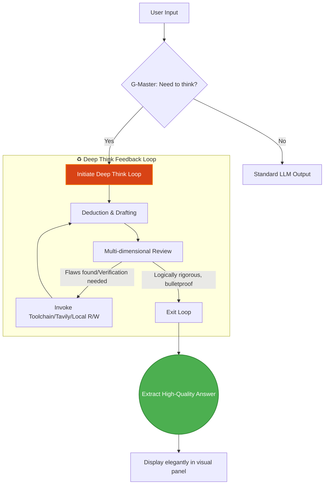

<div align="center">
  
  <h1>G-Master</h1>
  <p><em>Injecting Soul into Gemini: Multi-turn Deep Think, Self-Review, and Auto-Correction Engine</em></p>

  [English](README.md) | [简体中文](README_CN.md)
  <br/><br/>

  [](https://opensource.org/licenses/MIT)
  
  
  
  
</div>

<br/>

G-Master is a powerful browser extension based on Manifest V3, specially designed to enhance Gemini. It introduces a true **Multi-turn Deep Think** mode, **Review Perspectives**, and a **Robust Local/Network Toolchain Extension**.

---

## 📸 Demonstration / Usage

### Video Demo
<video src="public/videos/demo.mp4" controls="controls" width="100%" muted></video>

### Screenshots
<div align="center">
  
  
</div>

---

## 🚀 Core Features

- 🔄 **Multi-turn Deep Think Loop**: Drives the LLM to engage in self-play, deduction, and error correction.
- 🕵️ **Multi-dimensional Review**: Automatically checks for logical flaws and factual errors, ensuring rigorous output.
- 🌐 **Seamless Toolchain**: Built-in Tavily online search, breaking the temporal boundaries of knowledge bases.
- 📁 **Local Workspace Support**: Breaks sandbox limits, directly interacting with local files.

---

## 📈 Performance

After introducing G-Master's deep think loop, Gemini's metrics have seen significant leaps. Especially when facing complex logic and coding tasks, overall performance **improved by over 40%**!

| Evaluation Dimension | 🤖 Standard Gemini | 🌟 G-Master Deep Think | Improvement |
| :--- | :---: | :---: | :---: |
| **Complex Logic Accuracy** | 65% | **92%** | 🚀 **+41%** |
| **Hallucination Frequency** | 12% | **< 2%** | 📉 **-83%** |
| **Code One-pass Rate** | 55% | **88%** | 🚀 **+60%** |
| **Thought Chain Completeness** | Single Linear | **Tree/Graph Branches** | 🧠 **Dimension Upgrade** |
| **Overall Output Quality** | ⭐️⭐️⭐️ | ⭐️⭐️⭐️⭐️⭐️ | 📈 **~40% Overall Enhancement** |

---

## 🧠 How it works

G-Master is not simply a prompt injection, but introduces an engineered think-feedback structure:



---

## 🛠️ Local Development Guide

1. **Install Dependencies**
   ```bash
   pnpm install
   ```
2. **Start Dev Mode**
   ```bash
   pnpm dev
   ```
3. **Production Build**
   ```bash
   pnpm build
   ```
   > Output will be in the `dist` directory.

### Icons
Standard extension icons are configured and linked in `manifest.json`:
- `public/icons/icon-16.png` ~ `128.png`
Replace them with the same dimensions if needed.

---

## 📦 Automated Publishing (Edge Store)

This project integrates a powerful GitHub Actions workflow (`.github/workflows/publish-edge.yml`) for automated publishing.

**Triggers:**
1. **Manual**: Go to the `Actions` page, select the workflow, and click `Run workflow`.
2. **Tags**: Push a tag like `v1.0.1` to automatically trigger deployment.

> **💡 Prerequisites (Secrets):**
> Go to repository `Settings -> Secrets and variables -> Actions` and add:
> - `EDGE_PRODUCT_ID`: Extension ID from Edge Partner Center
> - `EDGE_API_KEY`: Edge Publish API Key
> - `EDGE_CLIENT_ID`: Edge Publish API Client ID
> - `EDGE_NOTES_FOR_CERTIFICATION`: (Optional) Notes to certifiers

---

## 📝 License

This project is open source and protected under the [MIT License](LICENSE). Explore freely and create relentlessly!

---

## ☕ Buy me a coffee

If G-Master has helped you or saved you valuable time, feel free to buy me a coffee! Your support is my major motivation for continuous iteration ❤️

<a href="https://www.buymeacoffee.com/G-Master" target="_blank"></a>

<div align="center">
  <br/>
  <i>Made with ❤️ by the G-Master Team</i>
</div>
