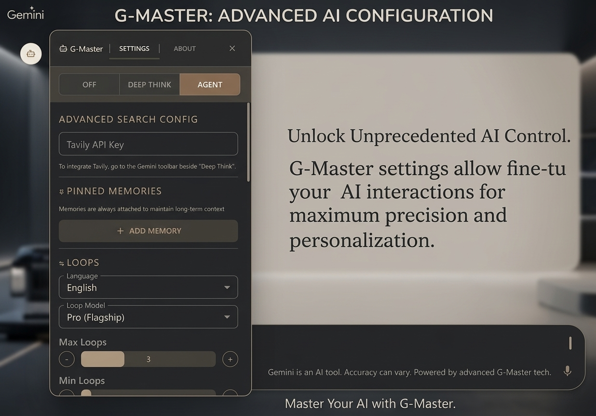
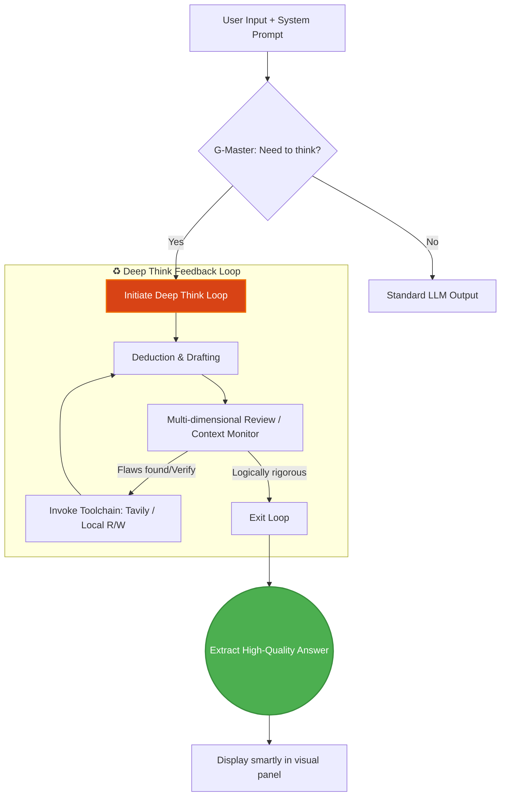

<div align="center">
  
  <h1>G-Master</h1>
  <p><em>Injecting Soul into Gemini: Multi-turn Deep Think, System Prompts, and Search Engines</em></p>

  [English](README.md) | [简体中文](README_CN.md)
  <br/><br/>

  [](https://opensource.org/licenses/MIT)
  
  
  
  
</div>

<br/>

G-Master is a powerful browser extension based on Manifest V3, specially designed to enhance Gemini. It introduces a true **Multi-turn Deep Think** mode, customizable **System Prompts**, real-time **Context & Intelligence Level** monitoring, and a built-in **Tavily Search** extension.

---

## 📸 Demonstration & Usage

### Interface & Features
<div align="center">
  
</div>

---

## 🚀 Core Features

- 🔄 **Multi-turn Deep Think Loop**: Drives the LLM to engage in self-play, deduction, and error correction.
- 🎯 **System Prompt Management**: Inject persistent system context and roles into Gemini seamlessly.
- 📊 **Context & Intelligence Monitoring**: Real-time visual panel of context usage and reasoning intelligence levels.
- 🌐 **Tavily Web Search**: Built-in online search breaking the temporal boundaries of base models.
- 📁 **Local Workspace Support**: Run Sandbox JS and interact directly with local files.

---

## 📊 Performance Leap

After introducing G-Master's deep think loop, Gemini's metrics see significant leaps, improving overall task execution by **over 40%**.

<div align="center">
  
</div>

---


| Evaluation Dimension | 🤖 Standard Gemini | 🌟 G-Master Deep Think | Improvement |
| :--- | :---: | :---: | :---: |
| **Complex Logic** | 65% | **92%** | 🚀 **+41%** |
| **Hallucination Rate**| 12% | **< 2%** | 📉 **-83%** |
| **Code One-pass** | 55% | **88%** | 🚀 **+60%** |
| **Thought Chain** | Single Linear | **Tree Branches** | 🧠 **Upgraded** |

---

## 🧠 Architecture WorkFlow

G-Master introduces an engineered think-feedback structure.



---

## 🛠️ Quick Developer Guide

1. **Install Dependencies**
   ```bash
   pnpm install
   ```
2. **Start Dev Mode**
   ```bash
   pnpm dev
   ```
3. **Build Extension**
   ```bash
   pnpm build
   ```
   > Load the `dist` directory in your browser's extension panel.

---

## 📝 License

This project is open source and protected under the [MIT License](LICENSE).

<div align="center">
  <br/>
  <i>Made with ❤️ by the G-Master Team</i>
</div>
