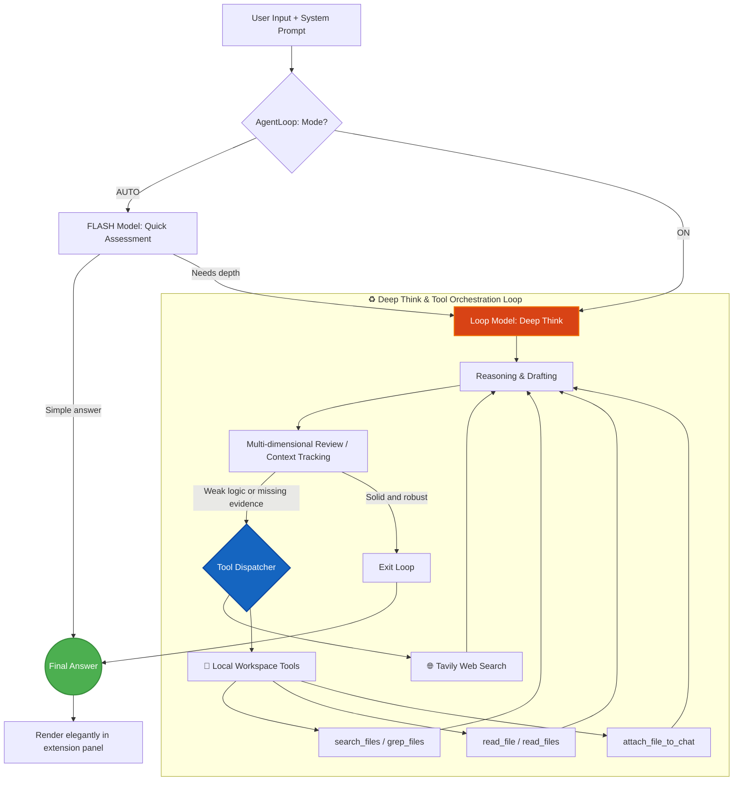

<div align="center">
  
  <h1>G-Master</h1>
  <p><em>Injecting Soul into Gemini: Multi-turn Deep Think, System Prompts, Local Workspace & Web Search Enhancement</em></p>

  [English](README.md) | [简体中文](README_CN.md)
  <br/><br/>

  [](https://opensource.org/licenses/MIT)
  
  
  
  
  
</div>

<br/>

G-Master is a powerful Manifest V3 browser extension built to supercharge Gemini. It introduces true **Multi-turn Deep Think**, persistent **System Prompt** management, a real-time **Context & Intelligence** monitor, and built-in **Tavily Web Search** to expand model capability.

---

## 💡 Why You Need G-Master (FAQ)

<div align="center">


</div>

> [!TIP]
> If you want Gemini to be more than "just chat" and gain persistent role memory, deeper reasoning, real-time retrieval, and practical local workflows, G-Master is the enhancement engine you are looking for.

<details>
<summary><strong>Q: Does Gemini Web natively support System Prompts?</strong></summary>

**A:** No. With G-Master, you can inject and persist a global System Prompt in one click, making Gemini far more stable for long-running roles and reducing context drift.

</details>

<details>
<summary><strong>Q: How can Gemini reason deeply like O1-style workflows?</strong></summary>

**A:** G-Master introduces a true multi-turn Deep Think loop for Gemini. It drives self-play, structured deduction, and flaw correction, lifting complex-logic accuracy by **41%** and one-pass coding success to **88%**.

</details>

<details>
<summary><strong>Q: Can Gemini directly read or modify files on my computer?</strong></summary>

**A:** Yes. With your authorization, G-Master's Local Workspace grants access to your local file system via the browser's File System Access API. You can browse directories, read files, search by name or content, and even **attach any file (images, PDFs, documents, videos) directly into the Gemini chat input** — all without leaving the browser.

</details>

<details>
<summary><strong>Q: What if Gemini's built-in knowledge is outdated?</strong></summary>

**A:** G-Master integrates Tavily Search to break the time boundary of base model knowledge and pull fresh information into your conversations.

</details>

---

## 📸 Demonstration & Usage

### Interface & Features
<div align="center">
  
</div>

---

## 🚀 Core Features

- 🔄 **Multi-turn Deep Think Loop**: Drives the model through self-play, iterative deduction, and automatic flaw correction via a unified `AgentLoop`.
- 🎯 **System Prompt Management**: Inject persistent role definitions and global reasoning context with one click.
- 📊 **Context & Intelligence Monitor**: Visualize current context utilization and reasoning depth in real time.
- 🌐 **Tavily Search Integration**: Built-in web search overcomes stale model knowledge with up-to-date information.
- 📁 **Local Workspace** — full-featured file toolkit for AI workflows:
  - 🔍 `search_files`: dual-mode smart search (keyword AND-matching + glob patterns like `src/**/*.ts`)
  - 📄 `grep_files`: search inside file contents with regex support (like `grep -r`)
  - 📎 `attach_file_to_chat`: paste any file (image / PDF / doc / video) directly into the AI chat input
  - 📖 `read_file`: read files with optional line-range (`startLine` / `endLine`) for large files
  - 💾 Auto-restore previously authorized workspace on page load
- 🎮 **Sudoku Mini-game**: a built-in Sudoku game to keep your brain sharp between prompts.

---

## 📊 Performance Gains

After enabling G-Master, complex reasoning and coding outcomes improve by **over 40%**, while hallucination frequency drops dramatically.

<div align="center">
  
</div>

---


| Evaluation Dimension | 🤖 Standard Gemini | 🌟 G-Master Deep Think | Improvement |
| :--- | :---: | :---: | :---: |
| **Complex Logic Accuracy** | 65% | **92%** | 🚀 **+41%** |
| **Hallucination Rate**| 12% | **< 2%** | 📉 **-83%** |
| **Code One-pass Success** | 55% | **88%** | 🚀 **+60%** |
| **Reasoning Path** | Single Linear Output | **Tree-like Divergence + Correction** | 🧠 **Dimension Upgrade** |

---

## 🧠 Core Architecture

G-Master is more than a shortcut wrapper. It is an engineered closed-loop reasoning and review system:



---

## 🛠️ Quick Developer Guide

1. **Install Dependencies**
   ```bash
   pnpm install
   ```
2. **Start Dev Mode**
   ```bash
   pnpm dev
   ```
3. **Build Extension**
   ```bash
   pnpm build
   ```
  > Then load the `dist` directory in your browser's Extensions panel.

---

## 📝 License

This project is open source and protected under the [MIT License](LICENSE).

<div align="center">
  <br/>
  <i>Made with ❤️ by the G-Master Team</i>
</div>
