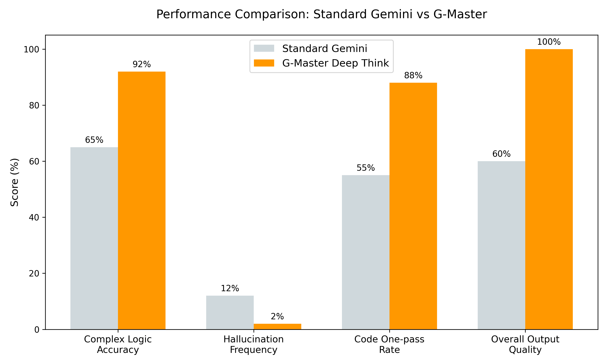
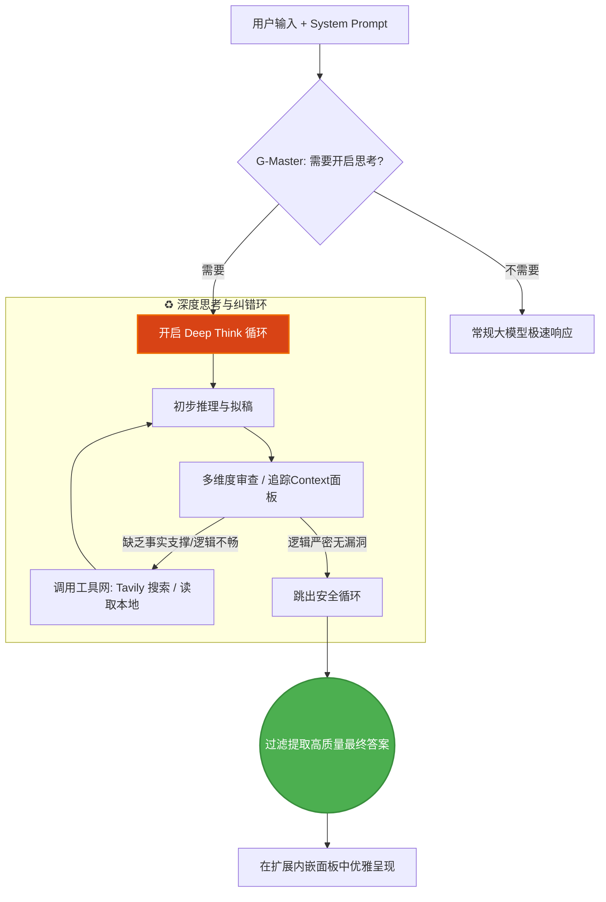

<div align="center">
  
  <h1>G-Master</h1>
  <p><em>为 Gemini 注入灵魂：多轮深度思考、System Prompt 与网络搜索增强引擎</em></p>

  [English](README.md) | [简体中文](README_CN.md)
  <br/><br/>

  [](https://opensource.org/licenses/MIT)
  
  
  
  
</div>

<br/>

G-Master 是一个基于 Manifest V3 的强大浏览器扩展，专为强化 Gemini 设计。它引入了真正的 **多轮深度思考 (Deep Think)** 模式、**系统提示词 (System Prompt)**管理、**上下文及智力水平监控面板**，以及内置的 **Tavily 在线搜索**拓展性能。

---

## 📸 效果与操作指南

### 界面与特性
<div align="center">
  
  
</div>

<br/>

<div align="center">
  <b>▶️ 深度思考与搜索演示</b><br/>
  <video src="public/videos/demo.mp4" controls="controls" width="80%" muted></video>
</div>

---

## 🚀 全新核心特性

- 🔄 **多轮深度思考循环**：驱动大模型进行自我博弈、推演与发现漏洞自动纠错。
- 🎯 **系统提示词 (System Prompt)**：一键注入持久化的角色设定与全局思考上下文。
- 📊 **智力与上下文监控面板**：实时直观显示当前的 Context 占用情况与模型智力水平。
- 🌐 **Tavily 搜索整合**：内置在线搜索，突破 AI 知识库的时间限制，提供最新资讯。
- 📁 **本地沙盒突破**：通过 Local Workspace 支持直接在本地读取/写入文件与运行代码。

---

## 📊 性能突破对比

引入 G-Master 之后，复杂的逻辑能力与编码任务均显著提升了 **40% 以上**，幻觉率大幅降低。

<div align="center">
  
</div>

| 评测维度 | 🤖 标准 Gemini | 🌟 G-Master 深度思考 | 提升幅度 |
| :--- | :---: | :---: | :---: |
| **复杂逻辑准确率** | 65% | **92%** | 🚀 **+41%** |
| **幻觉发生频次**| 12% | **< 2%** | 📉 **-83%** |
| **代码一次通过率** | 55% | **88%** | 🚀 **+60%** |
| **思维链路** | 单一线性输出 | **树状发散纠错**| 🧠 **维度升级** |

---

## 🧠 核心架构梳理

G-Master 并非单纯的快捷指令，而是构建了一个工程化的闭环纠错和审查结构：



---

## 🛠️ 简明开发指南

1. **安装依赖**
   ```bash
   pnpm install
   ```
2. **启动开发热更**
   ```bash
   pnpm dev
   ```
3. **构建打包发布**
   ```bash
   pnpm build
   ```
   > 然后在浏览器的 `扩展程序` 面板中加载 `dist` 文件夹即可体验。

---

## 📝 许可证 

本项目遵循 [MIT License](LICENSE) 开源协议。

<div align="center">
  <br/>
  <i>Made with ❤️ by the G-Master Team</i>
</div>
