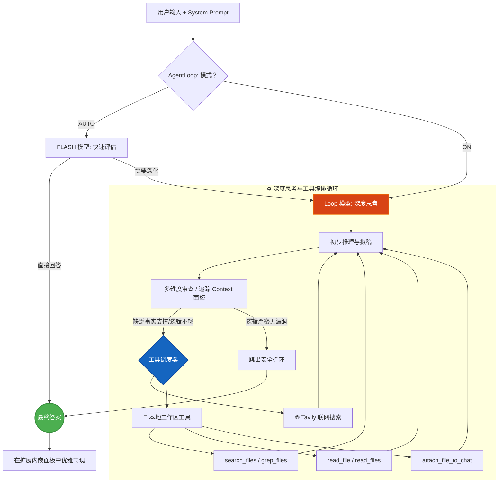

<div align="center">
  
  <h1>G-Master</h1>
  <p><em>为 Gemini 注入灵魂：多轮深度思考、System Prompt、本地工作区与网络搜索增强引擎</em></p>

  [English](README.md) | [简体中文](README_CN.md)
  <br/><br/>

  [](https://opensource.org/licenses/MIT)
  
  
  
  
  
</div>

<br/>

G-Master 是一个基于 Manifest V3 的强大浏览器扩展，专为强化 Gemini 设计。它引入了真正的 **多轮深度思考 (Deep Think)** 模式、**系统提示词 (System Prompt)**管理、**上下文及智力水平监控面板**，以及内置的 **Tavily 在线搜索**拓展性能。

---

## 💡 为什么你需要 G-Master？(FAQ)

<div align="center">


</div>

> [!TIP]
> 如果你希望 Gemini 不只是“会聊天”，而是具备长期角色记忆、深度推理、实时检索与本地工作流能力，G-Master 就是这套增强引擎。

<details>
<summary><strong>Q: 网页版 Gemini 支持 System Prompt (系统提示词) 吗？</strong></summary>

**A:** 原生不支持。安装 G-Master 后，你可以一键注入并持久化全局 System Prompt，让 Gemini 更稳定地扮演特定角色，并减少上下文漂移。

</details>

<details>
<summary><strong>Q: 如何让 Gemini 像 O1 一样进行深度思考 (Deep Think)？</strong></summary>

**A:** G-Master 为 Gemini 引入了真正的多轮 Deep Think 循环。它会驱动模型进行自我博弈、推演与漏洞纠错，将复杂逻辑准确率提升 **41%**，代码一次通过率提升至 **88%**。

</details>

<details>
<summary><strong>Q: Gemini 可以直接读取或修改我电脑上的本地文件吗？</strong></summary>

**A:** 可以。G-Master 的本地工作区基于浏览器 File System Access API，在你授权后即可访问本地目录。支持浏览目录、读取文件、按文件名或内容搜索，还可以将任意文件（图片、PDF、文档、视频）**直接粘贴到 Gemini 输入框**——全程无需离开浏览器。

</details>

<details>
<summary><strong>Q: Gemini 的知识库太旧怎么办？</strong></summary>

**A:** G-Master 内置 Tavily 搜索引擎，打破基础模型的时间边界，在对话中补充并抓取最新资讯。

</details>

---


## 📸 效果与操作指南

### 界面与特性
<div align="center">
  
</div>

---

## 🚀 全新核心特性

- 🔄 **多轮深度思考循环**：通过统一的 `AgentLoop` 驱动模型进行自我博弈、推演与发现漏洞自动纠错。
- 🎯 **系统提示词 (System Prompt)**：一键注入持久化的角色设定与全局思考上下文。
- 📊 **智力与上下文监控面板**：实时直观显示当前的 Context 占用情况与模型智力水平。
- 🌐 **Tavily 搜索整合**：内置在线搜索，突破 AI 知识库的时间限制，提供最新资讯。
- 📁 **本地工作区** —— AI 工作流全功能文件工具箱：
  - 🔍 `search_files`：双模式智能搜索（关键词 AND 匹配 + glob 模式，如 `src/**/*.ts`）
  - 📄 `grep_files`：在文件内容中搜索，支持正则表达式（类似 `grep -r`）
  - 📎 `attach_file_to_chat`：将任意文件（图片 / PDF / 文档 / 视频）直接粘贴到 AI 输入框
  - 📖 `read_file`：支持按行范围读取（`startLine` / `endLine`），大文件利器
  - 💾 应用启动时自动恢复已授权工作区，无需手动擤开页签
- 🎮 **数独小游戏**：内置数独，思考间隙撤小剧活脇。

---

## 📊 性能突破对比

引入 G-Master 之后，复杂的逻辑能力与编码任务均显著提升了 **40% 以上**，幻觉率大幅降低。

<div align="center">
  
</div>

| 评测维度 | 🤖 标准 Gemini | 🌟 G-Master 深度思考 | 提升幅度 |
| :--- | :---: | :---: | :---: |
| **复杂逻辑准确率** | 65% | **92%** | 🚀 **+41%** |
| **幻觉发生频次**| 12% | **< 2%** | 📉 **-83%** |
| **代码一次通过率** | 55% | **88%** | 🚀 **+60%** |
| **思维链路** | 单一线性输出 | **树状发散纠错**| 🧠 **维度升级** |

---

## 🧠 核心架构梳理

G-Master 并非单纯的快捷指令，而是构建了一个工程化的闭环纠错和审查结构：




## 🛠️ 简明开发指南

1. **安装依赖**
   ```bash
   pnpm install
   ```
2. **启动开发热更**
   ```bash
   pnpm dev
   ```
3. **构建打包发布**
   ```bash
   pnpm build
   ```
   > 然后在浏览器的 `扩展程序` 面板中加载 `dist` 文件夹即可体验。

---

## 📝 许可证 

本项目遵循 [MIT License](LICENSE) 开源协议。

<div align="center">
  <br/>
  <i>Made with ❤️ by the G-Master Team</i>
</div>
